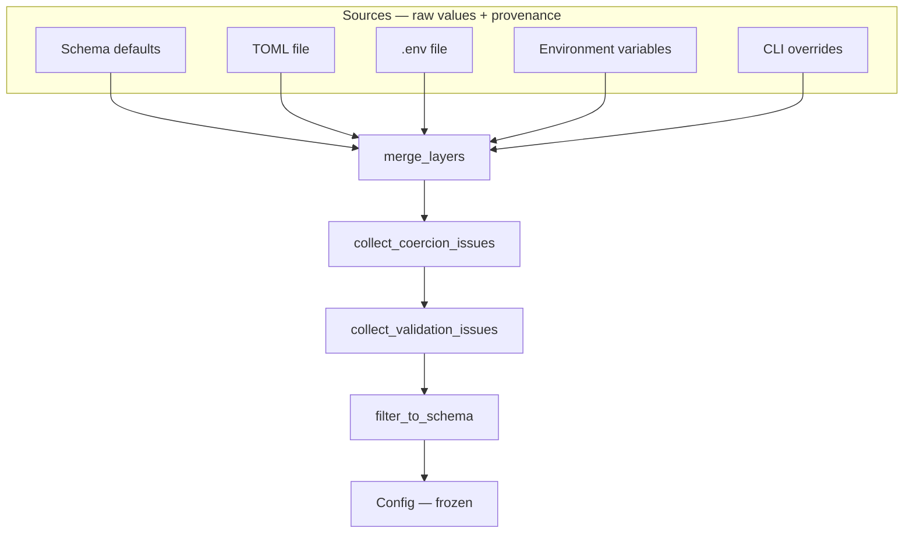

# Architecture

Config Manager loads configuration through a fixed pipeline. Each stage has a
single responsibility and can be tested independently.

## Pipeline

## Precedence

Later layers override earlier ones at the **leaf** level:

1. Schema defaults
2. TOML config file
3. `.env` file
4. Real environment variables
5. CLI `--set` overrides

Nested dicts are deep-merged. Scalars and lists replace the previous value
entirely. Replacing a nested dict with a scalar (or the reverse) is rejected.

## Modules

| Module | Role |
|--------|------|
| `schema.py` / `fields.py` | Declarative shape, defaults, docs, secret metadata |
| `sources.py` | Load raw values from each layer |
| `merge.py` | Deep merge with provenance tracking |
| `coercion.py` | Raw → typed Python values |
| `validation.py` | Constraints, required checks, strict unknown keys |
| `config.py` | Immutable `Config` with `get`, `explain`, masking |
| `cli.py` | Command-line interface |
| `dotenv.py` / `toml_loader.py` | Format parsers (stdlib only) |

## Design decisions

See [Architecture Decision Records](adr/) for rationale:

- [ADR 0001](adr/0001-declarative-schema-over-per-key-validators.md) — declarative schema
- [ADR 0002](adr/0002-read-only-config.md) — read-only resolved config
- [ADR 0003](adr/0003-toml-over-yaml-json.md) — TOML via stdlib `tomllib`
- [ADR 0004](adr/0004-validate-all-then-report.md) — collect all issues before failing
- [ADR 0005](adr/0005-secrets-masked-not-encrypted.md) — mask secrets in output

## Supported field types

| Type | Notes |
|------|-------|
| `str`, `int`, `float`, `bool` | Scalar coercion from strings, TOML, env |
| `list` | Comma-separated env values; JSON arrays; TOML arrays |
| `list` + `item_type` | Homogeneous scalar lists |
| `list` + `item_fields` | List of objects (TOML array-of-tables, JSON) |
| `dict` | Free-form maps; optional `value_type` for homogeneous values |
| Nested dicts | Structural grouping via schema tree (dotted paths) |

## Environment variable naming

With prefix `MYAPP`:

- `MYAPP_DATABASE__PORT=5432` → `database.port`
- Custom: `Field(..., env_name="API_TOKEN")` → `MYAPP_API_TOKEN`

Both `.env` and real environment variables follow the same prefix rules when
`--prefix` is set.
