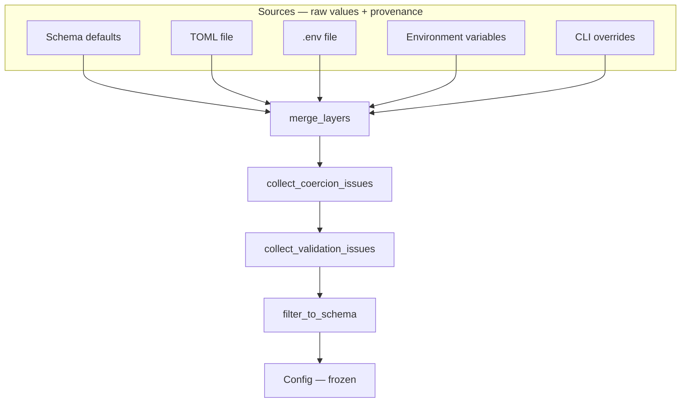

# Architecture

Config Manager loads configuration through a fixed pipeline. Each stage has a
single responsibility and can be tested independently.

## Pipeline

## Precedence

Later layers override earlier ones at the **leaf** level:

1. Schema defaults
2. TOML config file
3. `.env` file
4. Real environment variables
5. CLI `--set` overrides

Nested dicts are deep-merged. Scalars and lists replace the previous value
entirely. Type clashes (dict ↔ non-string scalar) are rejected; see
[Merge semantics](#merge-semantics) for the env/CLI string exception.

## Modules

| Module | Role |
|--------|------|
| `schema.py` / `fields.py` | Declarative shape, defaults, docs, secret metadata |
| `sources.py` | Load raw values from each layer |
| `merge.py` | Deep merge with provenance tracking |
| `coercion.py` | Raw → typed Python values |
| `validation.py` | Constraints, required checks, strict unknown keys |
| `config.py` | Immutable `Config` with `get`, `explain`, masking |
| `cli.py` | Command-line interface |
| `dotenv.py` / `toml_loader.py` | Format parsers (stdlib only) |

## Design decisions

See [Architecture Decision Records](adr/) for rationale:

- [ADR 0001](adr/0001-declarative-schema-over-per-key-validators.md) — declarative schema
- [ADR 0002](adr/0002-read-only-config.md) — read-only resolved config
- [ADR 0003](adr/0003-toml-over-yaml-json.md) — TOML via stdlib `tomllib`
- [ADR 0004](adr/0004-validate-all-then-report.md) — collect all issues before failing
- [ADR 0005](adr/0005-secrets-masked-not-encrypted.md) — mask secrets in output

## Supported field types

| Type | Notes |
|------|-------|
| `str`, `int`, `float`, `bool` | Scalar coercion from strings, TOML, env |
| `list` | Comma-separated env values; JSON arrays; TOML arrays |
| `list` + `item_type` | Homogeneous scalar lists |
| `list` + `item_fields` | List of objects (TOML array-of-tables, JSON) |
| `dict` | Free-form maps; optional `value_type` for homogeneous values |
| Nested dicts | Structural grouping via schema tree (dotted paths) |

## Environment variable naming

With prefix `MYAPP`:

- `MYAPP_DATABASE__PORT=5432` → `database.port`
- Custom: `Field(..., env_name="API_TOKEN")` → `MYAPP_API_TOKEN`

Both `.env` and real environment variables follow the same prefix rules when
`--prefix` is set.

## Merge semantics

Nested dicts are deep-merged across layers. Scalars and lists replace the
previous value entirely. Replacing a nested dict with a mapping (or the reverse)
is rejected with `ParseError`.

One exception: a **string may replace a dict** during merge when the next
pipeline stage will JSON-coerce that string into a dict (common for env/CLI
overrides of `Field(dict, ...)`). See `tests/test_merge_full.py`.

## Provenance

Each resolved leaf tracks a `Provenance` record (`source`, `name`, `raw_value`):

| Source | `source` value | Typical `name` |
|--------|----------------|----------------|
| Schema default | `default` | Dotted path |
| TOML file | `config_file` | Dotted path |
| `.env` file | `env_file` | Original variable name |
| Environment | `environment` | Original variable name |
| CLI `--set` | `cli` | CLI key from `--set` |

After `load()`, provenance is kept only for paths declared in `schema.fields`
(flat schema paths). Sub-paths inside list-of-object items or free-form dict
values are not tracked.

## Limitations

These behaviors are intentional but easy to miss:

| Topic | Behavior |
|-------|----------|
| **`--strict`** | Rejects unknown **top-level** leaves. Keys inside a declared `dict` field or list-of-object items are allowed (free-form content). |
| **`--lenient`** | Unknown keys are ignored during validation; `filter_to_schema()` drops them from the resolved config. |
| **`explain()` / `provenance()`** | Only flat schema paths (e.g. `database.port`, `servers`). Not `servers[0].host` or dict inner keys. |
| **`--allow-prefixless-env`** | Loads unprefixed environment variables. Useful for local dev; avoid in production shells with many env vars. |
| **CLI bracket paths** | Keys like `items[0].name` are supported, but multiple `--set` values for the same list are order-dependent; a later `items=[...]` replaces structure built by earlier bracket keys. |
| **`init` scaffolding** | Generates valid starter files for scalars, homogeneous lists, dicts, and list-of-objects. Complex nested shapes may still need hand-editing. |
| **Secret masking** | Masks flat schema paths and inferred/`secret=True` fields inside list-of-object items. Does not scan arbitrary keys inside free-form `dict` values. |
| **`.env` keys** | Must start with a letter or `_` (stricter than some dotenv tools). |

See also [API Reference](API.md) and [ADR 0005](adr/0005-secrets-masked-not-encrypted.md).
